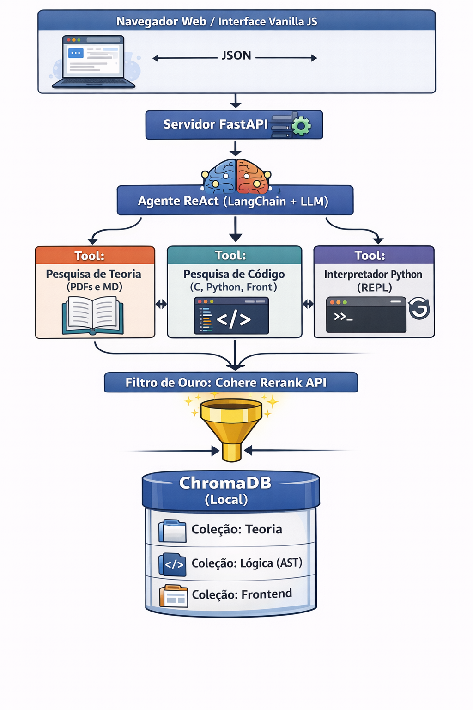

# AgentQA: RAG e ReAct para Análise de TCC Multi-linguagem

Este projeto implementa um **Agente Autônomo baseado na arquitetura ReAct** acoplado a um sistema **Advanced RAG (Retrieval-Augmented Generation) com Reranking**. 

O objetivo da ferramenta é atuar como um assistente de pesquisa (QA) capaz de navegar, compreender e cruzar informações entre artigos científicos (PDFs) e um repositório de código legado complexo (Python, C, HTML, JS) de um Trabalho de Conclusão de Curso (TCC). 

Ela contém fluxos de ingestão de dados que funciona especificamente para meu contexto, porém caso tenha um projeto que o agente precisa ler código e precisa ler documentações específicas e deseja usar esse agente QA, você deve alterar o código para seu projeto específico, principalmente a ingestão no Chorma.

## 🧠 Arquitetura do Sistema

O sistema foi desenhado para evitar "alucinações" separando o contexto teórico do contexto lógico (código) através de coleções vetoriais distintas e ferramentas (Tools) dedicadas para o LLM.



```bash
TCC-AgentQA/
├── Artigos/                 # Seus PDFs base (Tool de Teoria vai ler daqui)
├── assets/                  # Imagens e diagramas (fluxograma-atualizado.png)
├── PPSUS-main/              # O código original do TCC (A Tool de Código vai ler daqui) 
├── agent/                   # Onde o código irá ser trabalhado
│   ├── ingest_data.py       # O script que criamos na etapa anterior
│   └── requirements.txt     # As bibliotecas apenas do nosso agente
├── .env                     # 💡 Chave da OpenAI (NUNCA suba para o GitHub)
├── .gitignore               # 💡 Diz ao Git o que não subir
├── roadmap.md               # O seu planejamento do projeto
└── README.md                # 💡 A vitrine do projeto
```

Vale comentar que não subirei o código de meu TCC por se basear e códigos antigos feitos por outros colegar, como não sei ainda sobre as autorizações sobre deixar público o código, manterei no ignore.

### Componentes Principais:
1. **Frontend:** Interface Web leve em Vanilla JS + HTML.
2. **Backend / API:** Orquestração via `FastAPI`.
3. **Cérebro (Agente):** LangChain + OpenAI (`gpt-4o-mini`), utilizando o framework ReAct (Reasoning and Acting).
4. **Tools (Ferramentas):**
   - *Pesquisa de Teoria:* Busca semântica nos PDFs.
   - *Pesquisa de Código:* Busca otimizada via *Abstract Syntax Tree (AST)* para arquivos `.py` e `.c`.
   - *Interpretador Python (REPL):* Ambiente isolado para o agente testar lógicas geradas.
5. **Recuperação e Filtro:** `ChromaDB` (Local) combinado com a API da `Cohere` (Rerank) para garantir precisão cirúrgica no contexto entregue ao Agente.

## 🚀 Como Executar (Ambiente de Desenvolvimento)

**1. Clone o repositório e crie um ambiente virtual:**
```bash
python -m venv venv
source venv/bin/activate  # Linux/Mac
# ou venv\Scripts\activate para Windows